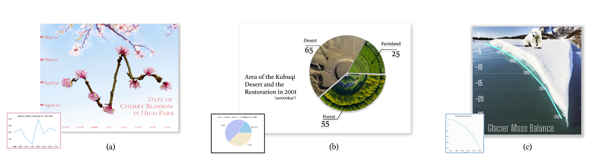
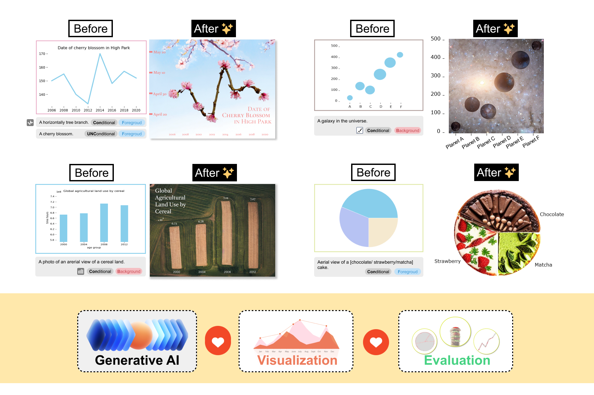
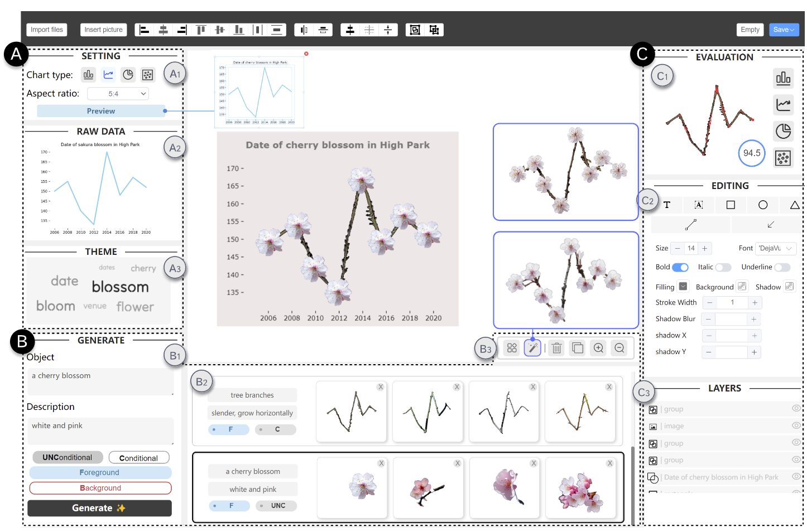

# Let the Chart Spark: Embedding Semantic Context into Chart with Text-to-Image Generative Model

This repository contains the code of *ChartSpark*, a novel system that embeds semantic context into chart based on text-to-image generative model.
*ChartSpark* generates pictorial visualizations conditioned on both semantic context conveyed in textual inputs and data information embedded in plain charts. The method is generic for both foreground and background pictorial generation, satisfying the design practices identified from an empirical research into existing pictorial visualizations.
We further develop an interactive visual interface that integrates a text analyzer, editing module, and evaluation module to enable users to generate, modify, and assess pictorial visualizations.

<!--  -->


## **Dependencies and Installation**

```bash
gitclone https://github.com/SerendipitysX/ChartSpark.git
cd ChartSpark
conda create --name <environment_name> --fisle requirements.txt
```

## Pretrained Model

In this work, we benefit from some excellent pretrained models, including [WebVectors](http://vectors.nlpl.eu/explore/embeddings/en/models/) for seeking the relevant words,  [DIS](https://github.com/xuebinqin/DIS) for background removal, and [diffusers](https://github.com/huggingface/diffusers) for generating the image containing semantic context.

To use these models, please follow the steps below:

1. **Generation**: We use three pipline from diffusers: `runwayml/stable-diffusion-v1-5`, `stabilityai/stable-diffusion-2-depth`, and `Fantasy-Studio/Paint-by-Example`. You can download and load them as local files, which can be specified in `chartSpeak.py line 37-44`.
2. **Removal**: Download the removal pretrained models from [here](https://drive.google.com/file/d/1XHIzgTzY5BQHw140EDIgwIb53K659ENH/view),  unzip the folder and save it to `mask/bg_removal.pth`.
3. **Extract Keyword (Optional)**: Select one of corpus from [WebVectors](http://vectors.nlpl.eu/explore/embeddings/en/models/) and save it to theme_extract `theme_extract/`. You will have three files: `meta.json`, `model.bin`, `model.txt`.

## Backend Setup
```
python chartSpeak.py
```

## Frontend Setup
see this video for real-world usage：[video](https://youtu.be/CeKCCFhZnw0?si=EigEFcelssTVUGLO)
1. Go to ChartSpark/frontend path
2. Install all the needed packages through npm
```
npm install
```
3. Compiles and hot-reloads for development
```
npm run dev
```

## Contact

We are glad to hear from you. If you have any questions, please feel free to contact [xrakexss@gmail.com](mailto:xrakexss@gmail.com) or open issues on this repository.

## Citation
```
@ARTICLE {xiao2023CharSpark,
author = {S. Xiao and S. Huang and Y. Lin and Y. Ye and W. Zeng},
journal = {IEEE Transactions on Visualization &amp; Computer Graphics},
title = {Let the Chart Spark: Embedding Semantic Context into Chart with Text-to-Image Generative Model},
year = {2024},
volume = {30},
number = {01},
issn = {1941-0506},
pages = {284-294},
doi = {10.1109/TVCG.2023.3326913},
publisher = {IEEE Computer Society},
address = {Los Alamitos, CA, USA},
month = {jan}
}
```
